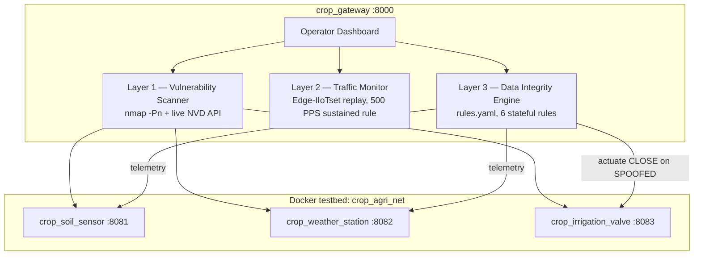

# CROP — Cyber Resilience for Optimized Precision Agriculture

**An edge-native OT security & data-integrity gateway for smart agriculture.**

> Layers 1 & 2 protect the device and the network. **Layer 3 protects the decision.**

    

## The Problem: What Happens When the Sensor Lies?

A compromised soil-moisture sensor reporting **"bone dry"** during heavy rain makes an automated irrigation controller **flood the field**. The network packets are perfectly valid; the protocol is happy; the IDS sees nothing wrong. The lie is in the _data_, not in the _transport_.

This is the **False Data Injection (FDIA) blind spot**: most agricultural IoT security research secures devices (Layer 1) and networks (Layer 2). Almost none validates whether telemetry is _physically truthful_ before an actuator acts on it (Layer 3).

## What CROP Is — and Is Not

| CROP **is**                                              | CROP **is not**                                            |
| -------------------------------------------------------- | ---------------------------------------------------------- |
| A containerized security middleware / "SOC for the farm" | A farm-management system (no yield maps, no FMIS features) |
| An explainable, rule-based FDIA defense engine           | A black-box ML classifier                                  |
| Edge-feasible (<20 ms decisions, ~160 MiB total RAM)     | A cloud-dependent SaaS                                     |
| Open-source, one-command reproducible                    | Agricultural hardware                                      |

## Architecture



## The Three Layers

| Layer | Function                                            | Implementation                                                                                                                      | Output                                                            |
| ----- | --------------------------------------------------- | ----------------------------------------------------------------------------------------------------------------------------------- | ----------------------------------------------------------------- |
| 1     | Endpoint vulnerability assessment                   | Real `nmap` binary (`-Pn`) in-container + live NIST NVD v2 keyword search                                                           | Open ports, service names, CVE context, 0–100 risk score          |
| 2     | Network threat detection                            | Deterministic replay of per-second rates derived from **Edge-IIoTset** captures; 3-consecutive-window sustained threshold (500 PPS) | DDoS alerts with dataset provenance                               |
| 3     | **Data integrity & sensor trust (core innovation)** | Declarative YAML rule plane + stateful Python engine                                                                                | Trust score 0–100, verdict, actuator blocking, XAI evidence array |

## Layer 3 Rule Plane (`gateway/rules.yaml`, hot-swappable)

| ID  | Rule                                                                              | Weight |
| --- | --------------------------------------------------------------------------------- | ------ |
| R1  | Cross-sensor conflict: rain > 10 mm/h AND moisture < 20 % (physically impossible) | 100    |
| R2  | Range plausibility: moisture / rain / temp outside physical bounds                | 70     |
| R3  | Rate-of-change: abs(Δmoisture) > 5 % per 60 s without rain or irrigation cause    | 50     |
| R4  | Command–effect: valve OPEN ≥ 300 s with < 1 % moisture response                   | 40     |
| R5  | Stuck/replay: zero variance over 8 readings while environment dynamic             | 30     |
| R6  | Corroboration: rain > 10 AND moisture > 50 (sensors agree)                        | +10    |

`trust = clamp(100 − Σpenalties + Σbonuses, 0, 100)` → **≤40 SPOOFED** (valve auto-CLOSED) · **41–70 DEGRADED** (actuation held) · **≥71 TRUSTED**.
Thresholds live in YAML and are mounted read-only: operators retune them with `docker compose restart`, **no rebuild**.

## Quickstart

```bash
git clone https://github.com/jeevanpb609/CROP.git
cd CROP
docker compose up --build -d
# open http://localhost:8000
```

Live demo: click **Simulate Spoof Attack** → trust collapses to 0, rule R1 evidence appears, valve auto-CLOSES. Wait ~40 s → the Edge-IIoTset flood window hits Module 02 (16k+ PPS, sustained alert).

## Evaluation

**Detection harness** (`python tools/integrity_tests.py`) — 7/7 PASS:

| Scenario | Profile                      | Verdict       | Rules                   |
| -------- | ---------------------------- | ------------- | ----------------------- |
| S1       | Bone-dry spoof during rain   | SPOOFED (0)   | R1                      |
| S2       | Benign dry day               | TRUSTED (100) | —                       |
| S3       | Rain + wet soil              | TRUSTED (100) | R6                      |
| S4       | Replay (frozen feed in rain) | DEGRADED (70) | R5                      |
| S5       | Drift spoof (+40 % / 65 s)   | DEGRADED (50) | R3                      |
| S6       | Valve open, no effect        | DEGRADED (60) | R4                      |
| S7       | Consistent two-sensor spoof  | TRUSTED (100) | _documented limitation_ |

**Latency** (`python tools/benchmark_latency.py`): L1 1281 ms avg (scheduled hygiene task, live NVD); **L2 15.0 ms; L3 19.6 ms** (real-time edge decisions).
**Footprint:** 4 containers ≈ **160 MiB RAM, <1 % CPU** (`docker stats`).

## Reproducibility & Honesty Notes

- `gateway/traffic_trace.json` (committed) is a **derived** replay trace; Layer 2 replays per-second rates computed offline from real captures — it is not live packet capture.
- Raw captures are not redistributed; see `datasets/DATASETS.md` (Edge-IIoTset, Ferrag et al., 2022).
- S7 is an explicit limitation: simultaneously spoofed, mutually consistent sensors defeat cross-validation (future work: external weather-API corroboration, spatial neighbour correlation).

## Citation

```bibtex
@misc{crop2026,
  title  = {CROP: Cyber Resilience for Optimized Precision Agriculture —
            A Three-Layer Data-Integrity Gateway for Ag-IoT},
  author = {M M, Anees Moidheen and Pitani, Sri Harsha and P B, Jeevan},
  year   = {2026},
  url    = {https://github.com/jeevanpb609/CROP}
}
```

Layer-2 traffic provenance: M. A. Ferrag et al., _Edge-IIoTset_, TechRxiv, 2022, doi:10.36227/techrxiv.18857336.v1.

## License

MIT — see `LICENSE`.
